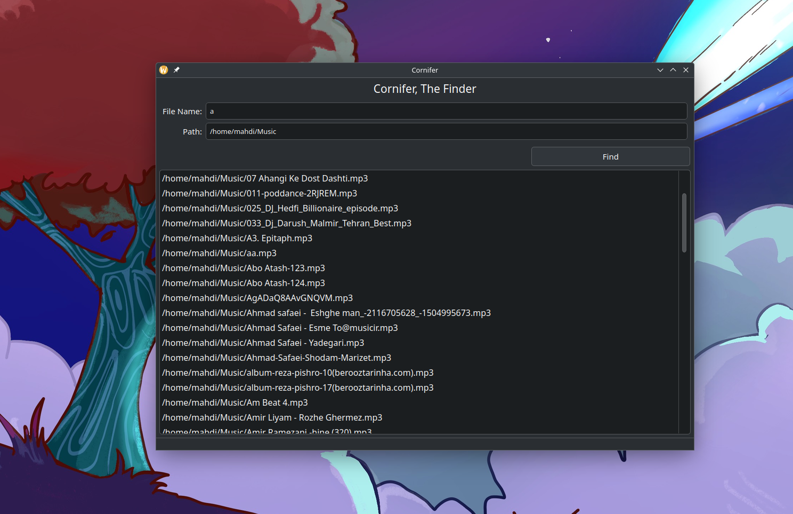

# Cornifer
Cornifer, The Finder

Cornifer is a file finder written in Qt framework. Its Aim is to be fast and
flexible. Cornifer allows you to stop your previous search and search for
new file immediately.

## Features
    - Fast
    - Stopping Functionality
    - Cross Platform

## Installation
    You need to have Qt installed on your system in order to build Cornifer.
    After that you can build Cornifer with:
``
cmake -Bbuild -H. && cd build && make
``

    
    
    